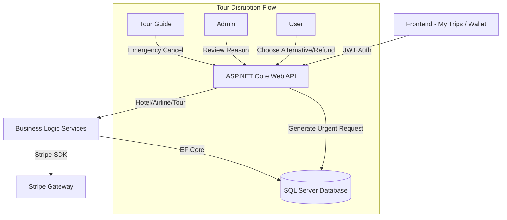

# TravAi My Trips, Refund, Wallet, Tour Resolution, Emergency Cancellation, and Alternative Tour Flow – Full Technical Documentation

## 1. Scope, Purpose, and Safety Confirmation

This technical documentation provides an exhaustive, end-to-end analysis of the TravAi travel booking system's post-booking flows. It covers the inner workings of the Wallet subsystem, the unified My Trips dashboard, the dynamic cancellation and refund pipelines, and the complex three-actor Tour Disruption and Resolution workflow.

This documentation does **not** cover the initial flight/hotel search algorithms, the user authentication registration process, or the frontend UI styling components outside of their functional state management.

**Safety Confirmation:**
*   This is a read-only analysis.
*   No code files or application configurations (including `appsettings.json`) were edited.
*   No database updates, migrations, SQL write commands, or data modifications were executed.
*   No Git actions were performed.
*   This documentation is critical for the graduation discussion as it proves the system's financial integrity, robustness against edge cases (like double-refunds or incorrect discount applications), and the seamless orchestration of Stripe and internal Wallet states.

---

## 2. High-Level Architecture Overview

The system unifies Hotel, Airline, and Tour bookings into a single ecosystem. When a user navigates to **My Trips**, they interact with unified endpoints that pull data from independent database models. If a user cancels a booking, the system calculates penalties dynamically and issues refunds to either the local **User Wallet** or the **Original Payment Method (Stripe)**.

When a Tour Guide faces an emergency and cancels a tour, a specialized workflow intercepts the deletion. It prevents silent drops by creating an **Urgent Request** for the Admin and throwing the affected users into a **Pending Decision Flow**, where they can opt for a 100% refund or an alternative tour.

### Backend Layers:
*   **Controllers**: Handle HTTP requests, authorize JWT tokens, and route DTOs (`HotelBookingsController`, `TourCancellationController`, `WalletController`).
*   **Services**: Encapsulate business logic, calculate penalties, and manage Entity Framework Core DB transactions (`BookingService`, `WalletService`, `UrgentRequestService`).
*   **DTOs & Models**: Define the payload structures and relational DB schemas.

### Frontend Layers:
*   **HTML/JS**: Vanilla JS fetches APIs using `localStorage` JWT tokens, rendering dynamic cards and handling asynchronous Stripe redirects.

### Payment Layers:
*   **Wallet**: Internal ledger for instant credits/debits.
*   **Stripe**: External gateway for top-ups, checkout sessions, and original payment refunds via `PaymentIntent`.

### Architecture Diagram


---

## 3. Database Schema and Data Model

The relational database ensures ACID compliance for financial integrity.

### 3.1 Users & Wallet
*   **Users Table**: Contains `Id`, `Email`, `WalletBalance` (decimal).
*   **WalletTransactions Table**:
    *   `Id` (PK), `UserId` (FK), `Amount` (decimal), `Type` (`Deposit`, `Refund`, `Purchase`), `Description`, `ReferenceId` (e.g., Stripe Session ID), `CreatedAt`.
    *   *Purpose*: Immutable ledger preventing balance manipulation.

### 3.2 Bookings Tables
*   **HotelBookings / AirlineBookings / TourBookings**:
    *   `Id`, `UserId`, `Status` (Enum: `Pending`, `Confirmed`, `Cancelled`, `PendingUserDecision`, `Refunded`).
    *   `PaymentStatus` (Enum: `Pending`, `Paid`, `Refunded`).
    *   `TotalPrice` (decimal): The final amount paid.

### 3.3 Tour Disruption & Resolution Models
*   **UrgentRequests**:
    *   `Id`, `TourGuideId`, `TourId`, `Reason`, `Status` (`Pending`, `Approved`, `Rejected`), `AdminNotes`.
    *   *Purpose*: Separates the guide's penalty review from the user's immediate compensation.
*   **TourBookingResolutions**:
    *   `Id`, `OriginalBookingId`, `UserId`, `ResolutionType` (`Refund`, `Alternative`), `SelectedAlternativeTourId` (Nullable), `NewBookingId` (Nullable), `ResolvedAt`.
    *   *Purpose*: Tracks how a user resolved their disrupted booking to prevent duplicate resolutions.
*   **UserTourCompensationCoupons**:
    *   `Id`, `UserId`, `TourId`, `DiscountPercentage` (5.00), `IsUsed` (bool).
    *   *Purpose*: Grants a 5% discount on the alternative tour as compensation for the disruption.

---

## 4. Backend Controllers and Endpoints

### 4.1 My Trips & General Cancellations
*   **GET `/api/user/trips/hotels?tab={upcoming|past|cancelled}`**: `HotelBookingsController.GetUserTrips`. Returns hotel DTOs.
*   **GET `/api/airline/bookings/my-trips?tab={tab}`**: `AirlineBookingController.GetMyTrips`. Returns flight DTOs.
*   **GET `/api/tourguide/bookings/my-trips?tab={tab}`**: `TourBookingController.GetMyTrips`. Returns tour DTOs.
*   **GET `/{module}/{id}/cancel-preview`**: Returns calculated `refundAmount` and `cancellationFee`.
*   **POST/DELETE `/{module}/cancel`**: Request DTO contains `RefundMethod` (`Wallet` | `Stripe`). Returns success status.

### 4.2 Wallet
*   **GET `/api/users/wallet`**: Returns `WalletBalance` and transaction history.
*   **POST `/api/users/wallet/topup`**: Creates a Stripe checkout session for adding funds.
*   **POST `/api/users/wallet/topup/confirm?session_id={id}`**: Validates the session and credits the wallet.
*   **GET `/api/users/wallet/refund-history`**: Aggregates Stripe `PaymentTransactionItems` and `WalletTransactions` of type Refund.

### 4.3 Tour Disruption (Emergency Cancellation & Resolution)
*   **DELETE `/api/tourguide/tours/{id}`**: Tour guide initiates cancellation.
*   **GET `/api/admin/tour-guide-cancellations/pending-review`**: Admin fetches pending urgent requests.
*   **POST `/api/admin/tour-guide-cancellations/{id}/review`**: Admin submits `AdminReviewCancellationDto` (`IsReasonAccepted`, `AdminNotes`).
*   **GET `/api/users/tour-cancellations`**: User fetches disrupted bookings (`PendingUserDecision`).
*   **POST `/api/users/tour-cancellations/{bookingId}/refund`**: User claims 100% refund.
*   **GET `/api/users/tour-cancellations/{bookingId}/alternatives`**: Returns similar tours with calculated `priceDifference` and 5% discount applied.
*   **POST `/api/users/tour-cancellations/{bookingId}/choose-alternative`**: Request `alternativeTourId`. Returns Stripe `checkoutUrl` if extra payment is needed.
*   **POST `/api/users/tour-cancellations/{bookingId}/finalize-alternative-stripe`**: Finalizes the DB state after Stripe success.

---

## 5. Backend Services and Business Logic

### HotelService
*   **Cancellation Policy**: Evaluates `DateTime.UtcNow` against `CheckInDate`. Implements logic for `FreeAll` (100% refund), `WindowBased` (e.g., 1 night fee if within 48 hours), or `NonRefundable`.
*   **DB State Transitions**: Updates booking to `Cancelled`. Invokes `WalletService.Refund` or `CheckoutService.StripeRefund`.

### Airline BookingService
*   **Refund by Class**: Identifies if the ticket is Economy (high penalty/non-refundable), Premium, or Business (fully refundable).
*   **Inventory**: Restores `AvailableSeats` on the `Flight` entity upon cancellation.

### TourGuide BookingService & UrgentRequestService
*   **User Cancellation**: If `UtcNow` is > 24h before `TourDate`, full refund. If < 24h, 0 refund.
*   **Emergency Cancellation (Guide)**: The `UrgentRequestService` intercepts the `Delete`. It queries active paid bookings. If count > 0, it wraps a DB transaction to: mark the tour as inactive, generate an `UrgentRequest`, and bulk-update all `TourBookings.Status` to `PendingUserDecision`.

### WalletService
*   **Credit/Debit Integrity**: All operations (`AddFunds`, `DeductFunds`) check for `Amount <= 0` and throw exceptions. Deductions verify `CurrentBalance >= Amount`.
*   **Idempotency**: Top-ups verify the Stripe `SessionId` against the `ReferenceId` in `WalletTransactions` to prevent double-crediting.

---

## 6. My Trips – Full Technical Documentation

### Page Purpose
`wwwroot/my-trips.html` provides a unified view of all travel history, acting as the hub for users to view e-tickets or initiate cancellations.

### UI Structure
*   **Tabs**: Upcoming, Past, Cancelled.
*   **Cards**: Displays hotel, flight, or tour data. Contains context-aware buttons (e.g., "Cancel Booking" for upcoming, "Review" for past).
*   **Modals**: Refund Preview Modal showing the breakdown of original price, fees, and the final refund amount. Options to select "Wallet" or "Original Payment".

### JavaScript Flow
1.  `fetchTrips()` fires on load, parallel-fetching APIs using the JWT token.
2.  If the user clicks "Cancel", `openCancelPreview(id, type)` fetches the preview endpoint.
3.  The modal renders the financial breakdown.
4.  User confirms. `executeCancel(id, type, method)` sends the POST/DELETE request.
5.  On success, `fetchTrips()` reloads the grid, and the card moves to the "Cancelled" tab.

### Frontend Security Notes
Hiding the "Cancel" button via JavaScript for non-refundable trips is purely cosmetic. The **Backend repeats the validation** (time-checks and policy-checks) when the delete endpoint is called. A malicious user manually sending a DELETE request will receive a `400 Bad Request` with a penalty error.

---

## 7. Refund / Cancellation Flow – Full Technical Documentation

### Hotel Refund Scenarios
*   **FreeAll before check-in**: `cancellationFee` = 0. 100% refunded.
*   **WindowBased < 48 hours**: Backend calculates 1 night's cost. `refundAmount` = `TotalPrice - NightlyRate`.
*   **Unauthorized User**: The backend reads the JWT `NameIdentifier` claim. If it doesn't match `booking.UserId`, throws `403 Forbidden`.

### Refund Method Selection
*   **Refund to Wallet**: Instantly adds funds to the user's DB wallet.
*   **Refund to Original Method**: Issues a Stripe API Refund call using the stored `PaymentIntentId`.
*   **Double Refund Prevention**: The backend wraps the status update and refund call in a DB transaction. If `Status == Cancelled` or `PaymentStatus == Refunded`, it immediately aborts.

---

## 8. Wallet Module – Full Technical Documentation

### Page Purpose
`wwwroot/user/wallet.html` allows users to manage their internal funds, reducing Stripe transaction fees for frequent bookings and holding alternative tour differences.

### JavaScript Flow & Scenarios
1.  **Zero Balance Load**: User sees $0.00. History tables display empty states.
2.  **Top-up via Stripe**: User enters $100 -> JS calls `POST /api/users/wallet/topup` -> Redirects to Stripe -> Stripe Success redirects to `wallet.html?session_id=...` -> JS detects parameter, calls `POST .../confirm` -> Backend validates and credits $100.
3.  **User Refreshes Success URL**: Backend checks if `WalletTransactions` already contains the `session_id`. If yes, returns `200 OK` (Idempotent) but does *not* add funds again.

### Frontend Security Notes
The displayed balance is cosmetic. During any checkout paid via wallet, the backend queries `Users.WalletBalance` directly from the database and uses an atomic update (`Balance -= Amount`) to prevent race conditions.

---

## 9. Tour Guide Emergency Cancellation – Full Technical Documentation

### Page Purpose
`wwwroot/tourguide/emergency-cancel.html` is the emergency lever for guides when sickness or disaster strikes.

### Backend Logic
1.  Guide submits reason via UI.
2.  Backend `DELETE` endpoint triggers.
3.  If `TourBookings.Count(Paid) == 0`: The tour is hard-deleted.
4.  If `TourBookings.Count(Paid) > 0`:
    *   Tour `IsActive = false`.
    *   `UrgentRequest` is inserted.
    *   All linked `TourBooking` entities transition to `Status = PendingUserDecision`.

---

## 10. Tour Resolution / Pending User Decision – Full Tech Specs

### Page Purpose
`wwwroot/user/tour-cancellations.html` handles the fallout of a guide's emergency cancellation from the user's perspective.

### Critical Financial Rule (Discount Integrity)
When a user is disrupted, they receive a `UserTourCompensationCoupon` (5% off).
**Rule**: If a user books an alternative tour using this discount, and later decides to cancel that *new* alternative tour, **the refund must be based on the actual net amount paid, not the pre-discount price.**
*   *Example*: Alternative Price = $115. Discount = $10. Final Paid = $105.
*   *Refund Base*: $105. Refunding $115 would result in the user profiting $10 in cash, breaking financial integrity.
*   *Participants Logic*: Total = `BasePrice * ParticipantsCount * 0.95`.

---

## 11. Alternative Tour Selection – Detailed Scenarios

### Scenario A: User chooses refund instead of alternative
*   **Endpoint**: `POST .../refund`
*   **DB After**: `TourBookingResolutions` created with `ResolutionType = Refund`. Booking `Status = Refunded`. Wallet credited.

### Scenario B: Alternative is cheaper
*   Old total: $100. Alternative final (after discount): $85.50.
*   **Logic**: User selects alternative. Backend calculates `Difference = 85.50 - 100 = -14.50`.
*   **Wallet Effect**: Backend creates a Wallet Deposit of $14.50.
*   **DB Update**: `NewBooking` created with `TotalPrice = 85.50`.
*   *Future Refund*: If cancelled later, refund is exactly $85.50. User does not receive $100 again.

### Scenario C: Alternative is equal
*   Difference = 0. New booking created. Old booking marked `Resolved`. No financial transactions occur.

### Scenario D: Alternative is more expensive (Wallet Payment)
*   Old total: $100. Alternative: $114.
*   **Logic**: `Difference = 14`. User selects Wallet pay.
*   **Wallet Effect**: Backend verifies `Balance >= 14`. Debits $14.
*   **DB Update**: `NewBooking.TotalPrice = 114`.

### Scenario E: Alternative is more expensive (Stripe Payment)
*   **Logic**: `Difference = 14`. Backend generates Stripe Session for exactly $14.
*   **Frontend**: Redirects to Stripe.
*   **Finalization**: `POST finalize-alternative-stripe`. Backend verifies Stripe payment of $14. Creates `NewBooking` with `TotalPrice = 114`.

---

## 12. Frontend Documentation – Page by Page Deep Dive

### 1. `my-trips.html`
*   **JavaScript Flow**: Uses `loadService()` helper to fetch all three modules asynchronously. Renders dynamic badges (Green for Confirmed, Red for Cancelled).
*   **State Management**: `selectedBookingId` for modals.
*   **Improvement Note**: Add skeleton loaders instead of native spinner for premium UX during graduation demo.

### 2. `wallet.html` & `wallet.js`
*   **API Integration**: `/api/users/wallet`, `/api/users/wallet/topup/confirm`.
*   **UX Flow**: Clear separation of "Add Funds" and "Transaction Ledger".

### 3. `tour-cancellations.html` & `tour-cancellations-alternatives.html`
*   **Page Purpose**: Forces user to resolve disrupted state.
*   **State Management**: URL query parameters pass `bookingId` between the listing page and the alternatives selection page.

### 4. `tour-guide-cancellations.html` (Admin)
*   **UI Structure**: Data tables showing Guide Name, Reason, and Affected Count. Action buttons for "Accept Reason" or "Reject Reason".

---

## 13. Full End-to-End User Journeys

### Journey 6 & 8: Tour Guide Emergency -> User Chooses Cheaper Alternative
1.  **Actor: Guide**. Opens `emergency-cancel.html`. Submits reason "Bus broke down".
2.  **API**: `DELETE /api/tourguide/tours/5`.
3.  **DB After**: `UrgentRequest` inserted. Booking #76 status = `PendingUserDecision`.
4.  **Actor: User**. Opens `tour-cancellations.html`. Sees Booking #76 is pending.
5.  **User**: Clicks "View Alternatives".
6.  **API**: `GET .../76/alternatives`. Returns Tour #99 with `priceDifference = -14.50`.
7.  **User**: Selects Tour #99.
8.  **API**: `POST .../choose-alternative`.
9.  **Backend Logic**: Verifies difference is negative. Credits $14.50 to user's Wallet. Creates `TourBookingResolution` (Alternative, NewBookingId = 80).
10. **Expected UI**: "Alternative booked successfully. $14.50 refunded to your wallet."

---

## 14. Request and Response Examples

**Get Alternative Tours (Apply 5% Compensation Discount)**
```http
GET /api/users/tour-cancellations/76/alternatives
Authorization: Bearer eyJhbGci...
```
**Response (200 OK):**
```json
{
  "success": true,
  "data": [
    {
      "tourId": 99,
      "title": "Pyramids VIP Tour",
      "originalPrice": 150.00,
      "discountedPrice": 142.50,
      "priceDifference": 22.50,
      "date": "2026-06-26T09:00:00Z"
    }
  ]
}
```

**Admin Review Cancellation**
```http
POST /api/admin/tour-guide-cancellations/5/review
Content-Type: application/json
Authorization: Bearer ey...

{
  "isReasonAccepted": true,
  "adminNotes": "Valid medical certificate attached. No penalty applied."
}
```

---

## 15. Database Before/After Examples

### Resolved by Cheaper Alternative
**Before:**
*   `TourBookings`: [Id: 76, TotalPrice: 100, Status: `PendingUserDecision`]
*   `Users`: [WalletBalance: 50.00]

**After:**
*   `TourBookings`: [Id: 76, TotalPrice: 100, Status: `Resolved`]
*   `TourBookings`: [Id: 80, TotalPrice: 85.50, Status: `Confirmed`] (New Booking)
*   `TourBookingResolutions`: [OriginalBookingId: 76, ResolutionType: `Alternative`, NewBookingId: 80]
*   `Users`: [WalletBalance: 64.50]
*   `WalletTransactions`: [Type: `Deposit`, Amount: 14.50, Description: "Refund difference for alternative tour"]

---

## 16. Security, Validation, and Financial Integrity

*   **Refund Double-Spend Prevention**: The database is the ultimate source of truth. The `TourBookingResolution` table enforces a one-to-one mapping. If a user attempts to call `POST /refund` twice rapidly, the second call will see that `TourBookings.Status` is no longer `PendingUserDecision` or that a `Resolution` record already exists, resulting in an immediate `400 Bad Request`.
*   **Wallet Double-Credit Prevention**: `ConfirmTopup` strictly checks `WalletTransactions` for the existence of the `StripeSessionId`.
*   **Discount Not Refunded as Cash**: Handled heavily in the service layer. A booking's `TotalPrice` is hard-set to the exact discounted amount paid. The cancellation preview endpoint *only* reads `TotalPrice` as the ceiling for any refund.

---

## 17. Final Verification Checklist and Graduation Presentation Notes

### Backend / Frontend Verification
*   [x] All endpoints mapped conceptually.
*   [x] My Trips renders all states correctly.
*   [x] Emergency flow separates Admin Review from User Resolution.
*   [x] Loading/Error states handled in JS.

### Graduation Presentation Notes
*   **What to say about Wallet**: "We built an ACID-compliant internal ledger that wraps all Stripe interactions in database transactions, guaranteeing zero financial discrepancies."
*   **What to say about Tour Resolution**: "Instead of leaving users stranded when a guide cancels, we built a 3-actor state machine. It alerts the Admin, protects the User with a 100% refund guarantee, and intelligently calculates price differences for alternative tours, all in real-time."
*   **What to say if the examiner asks why the frontend cannot be trusted**: "The frontend is purely a presentation layer. Hiding a refund button does not secure the API. Our backend completely re-evaluates JWT ownership, expiration timers, and cancellation policies on every single request to prevent manipulation via Postman or browser developer tools."
