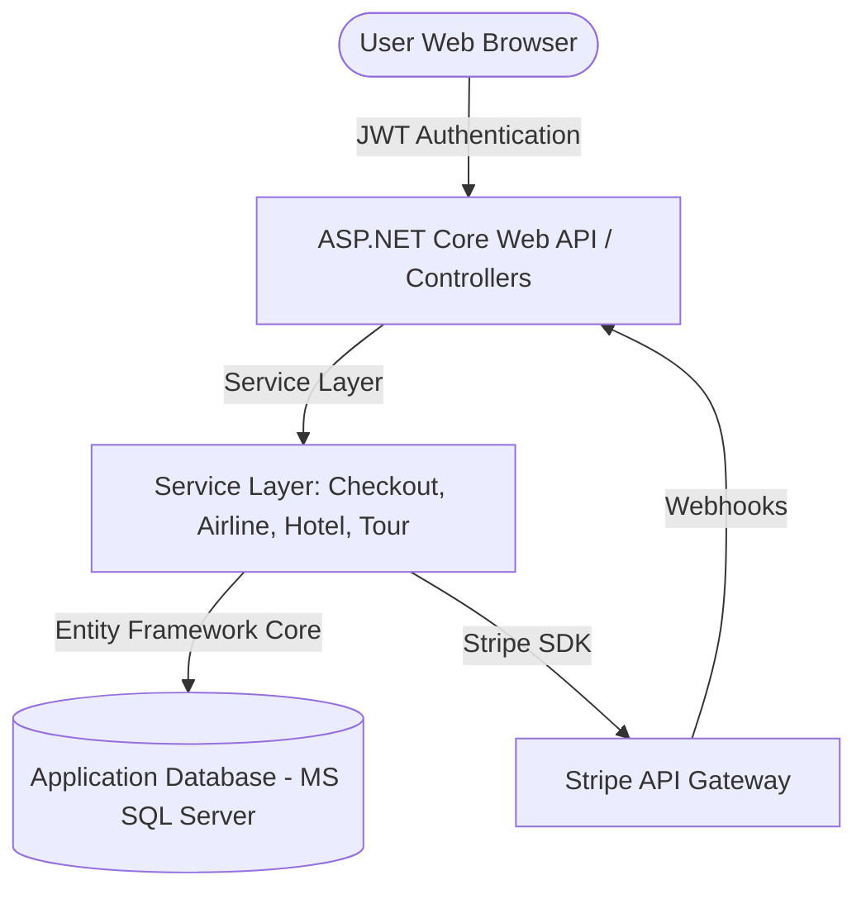
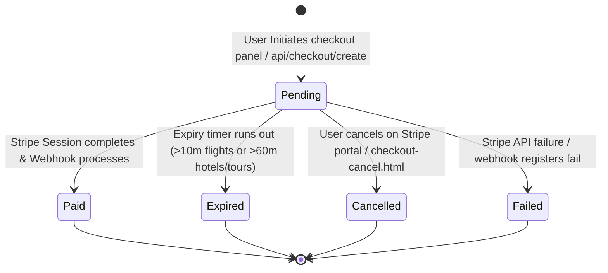
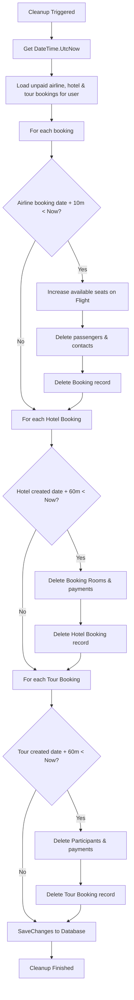
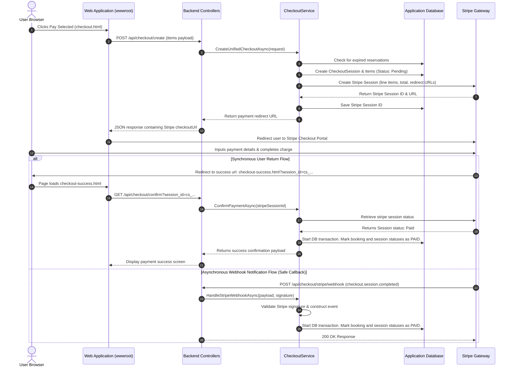

# TravAi Technical Documentation
## Unified Booking to Stripe Payment Flow & Architecture

---

## 1. System Overview & Architecture

TravAi is a modern, unified travel booking web application that integrates three distinct travel service domains under a single authentication context and payment flow:
1. **Airlines Module**: Offers flight search, flight reservations, companion travelers management, passenger details capturing (passport, DOB, etc.), and boarding pass printing.
2. **Hotels Module**: Features hotel search, room booking selection, room check-in/check-out planning, and booking management.
3. **Tour Guide Module**: Allows booking immersive guided tour cards, scheduling tours on future dates, and catalog searching.

### High-Level Architectural Flow


The system uses a monolithic architecture with modular layouts. All modules are tied together on the frontend through unified authentication and a centralized **Checkout Page** (`checkout.html`). The backend is powered by **ASP.NET Core** and **Entity Framework Core**, using a relational schema to manage state transitions and coordinate transactions.

### Key Timers and Expirations
To prevent stale inventory reservation, the backend implements hard booking expiration schedules:
*   **Airline Booking Reservation**: Valid for exactly **10 minutes** (`AirlineExpirationMinutes = 10`) from the time of booking.
*   **Hotel Booking Reservation**: Valid for exactly **60 minutes** (`HotelTourExpirationMinutes = 60`) from the time of creation.
*   **Tour Booking Reservation**: Valid for exactly **60 minutes** (`HotelTourExpirationMinutes = 60`) from the time of creation.

If the user does not complete checkout within these windows, background cleanup triggers (which run on every pending fetch or checkout initiation) will cascadingly release seats, delete booking records, and delete associated passengers or payment placeholders to free up system capacity.

---

## 2. Database Models and Schema Design

The application states are persisted inside a relational SQL database. The following lists the exact database schemas for checkout, payment transactions, flights, hotel, and tour domains.

### 2.1 CheckoutSession Model
A checkout session represents a single transaction attempt initiated by a user. It records the total amount, the status of payment, Stripe integration links, and timestamps.

| Database Column Name | Data Type | Nullability | Constraints / Keys | Description |
| :--- | :--- | :--- | :--- | :--- |
| **Id** | `bigint` | NOT NULL | PRIMARY KEY, Identity | Unique internal identifier for the checkout session. |
| **UserId** | `bigint` | NOT NULL | FOREIGN KEY (`Users.Id`) | The identifier of the user who owns this session. |
| **CheckoutType** | `nvarchar(50)` | NOT NULL | Max Length: 50 | Type of checkout. Values: `Airline`, `HotelTour`, `Selected`. |
| **Status** | `nvarchar(50)` | NOT NULL | Max Length: 50 | Current state of the session. Values: `Pending`, `Paid`, `Expired`, `Cancelled`, `Failed`. |
| **TotalAmount** | `decimal(18,2)` | NOT NULL | - | Total price of all items selected in this transaction. |
| **Currency** | `nvarchar(10)` | NOT NULL | Max Length: 10, Default: `"usd"` | Currency code for payment. |
| **StripeCheckoutSessionId** | `nvarchar(255)` | NULL | Max Length: 255 | Stripe-generated checkout session token (e.g. `cs_test_...`). |
| **StripePaymentIntentId** | `nvarchar(255)` | NULL | Max Length: 255 | Stripe-generated payment intent token (e.g. `pi_...`). |
| **ExpiresAt** | `datetime2` | NOT NULL | - | UTC timestamp when this payment window expires. |
| **CreatedAt** | `datetime2` | NOT NULL | - | UTC timestamp when this record was created. |
| **PaidAt** | `datetime2` | NULL | - | UTC timestamp when payment was confirmed. |
| **CancelledAt** | `datetime2` | NULL | - | UTC timestamp when payment was cancelled. |
| **FailureReason** | `nvarchar(1000)` | NULL | Max Length: 1000 | Log of reason if the payment failed. |

---

### 2.2 CheckoutSessionItem Model
Maps individual booking reservations (flights, hotel bookings, or tours) to a parent `CheckoutSession`.

| Database Column Name | Data Type | Nullability | Constraints / Keys | Description |
| :--- | :--- | :--- | :--- | :--- |
| **Id** | `bigint` | NOT NULL | PRIMARY KEY, Identity | Unique identifier. |
| **CheckoutSessionId** | `bigint` | NOT NULL | FOREIGN KEY (`CheckoutSessions.Id`) | Parent session. |
| **ItemType** | `nvarchar(50)` | NOT NULL | Max Length: 50 | Typification of booking: `AirlineBooking`, `HotelBooking`, `TourBooking`. |
| **ReferenceId** | `bigint` | NOT NULL | - | The primary key of the booking record in its respective table. |
| **DisplayName** | `nvarchar(255)` | NULL | Max Length: 255 | UI readable description (e.g. `Flight MS101 (CAI -> DXB)`). |
| **Amount** | `decimal(18,2)` | NOT NULL | - | Cost of this item at booking time. |
| **CreatedAt** | `datetime2` | NOT NULL | - | Creation timestamp. |

---

### 2.3 PaymentTransaction Model
Represents a payment attempt ledger linked to the checkout session. It stores raw callbacks from Stripe for auditing.

| Database Column Name | Data Type | Nullability | Constraints / Keys | Description |
| :--- | :--- | :--- | :--- | :--- |
| **Id** | `bigint` | NOT NULL | PRIMARY KEY, Identity | Transaction ID. |
| **CheckoutSessionId** | `bigint` | NOT NULL | FOREIGN KEY (`CheckoutSessions.Id`) | Checkout session. |
| **Provider** | `nvarchar(50)` | NOT NULL | Max Length: 50, Default: `"Stripe"` | Payment aggregator brand. |
| **ProviderTransactionId** | `nvarchar(255)` | NULL | Max Length: 255 | Stripe PaymentIntent Id. |
| **ProviderCheckoutSessionId**| `nvarchar(255)` | NULL | Max Length: 255 | Stripe Checkout Session Id. |
| **Amount** | `decimal(18,2)` | NOT NULL | - | Ledger transaction amount. |
| **Currency** | `nvarchar(10)` | NOT NULL | Max Length: 10, Default: `"usd"` | Target currency. |
| **Status** | `nvarchar(50)` | NOT NULL | Max Length: 50 | Status: `Pending`, `Paid`, `Failed`, `Refunded`, `Cancelled`, `Expired`. |
| **PaidAt** | `datetime2` | NULL | - | Completion timestamp. |
| **CreatedAt** | `datetime2` | NOT NULL | - | Creation timestamp. |
| **RawProviderResponse** | `nvarchar(max)` | NULL | - | Serialized JSON response payload received from Stripe. |

---

### 2.4 StripeWebhookEvent Model
Logs webhook notifications received from Stripe to prevent duplicate processing (idempotency) and log payment histories.

| Database Column Name | Data Type | Nullability | Constraints / Keys | Description |
| :--- | :--- | :--- | :--- | :--- |
| **Id** | `bigint` | NOT NULL | PRIMARY KEY, Identity | Event log record ID. |
| **StripeEventId** | `nvarchar(255)` | NOT NULL | Max Length: 255 | Stripe webhook event identifier (e.g. `evt_...`). |
| **EventType** | `nvarchar(255)` | NOT NULL | Max Length: 255 | Type of event (e.g. `checkout.session.completed`). |
| **CheckoutSessionId** | `bigint` | NULL | FOREIGN KEY (`CheckoutSessions.Id`) | Associated checkout session. |
| **PaymentTransactionId** | `bigint` | NULL | FOREIGN KEY (`PaymentTransactions.Id`) | Associated payment transaction. |
| **RawJson** | `nvarchar(max)` | NULL | - | Serialized webhook event payload. |
| **CreatedAt** | `datetime2` | NOT NULL | - | Creation date. |

---

### 2.5 Airline Booking & Passenger Models
The Airlines module stores flight bookings and lists passenger travel papers.

#### Booking Schema (Airlines)
*   **Id** (`bigint`, PK, Identity): Booking reference.
*   **UserId** (`bigint`, FK `Users.Id`): Booking owner.
*   **FlightId** (`bigint`, FK `Flights.Id`): Booked flight.
*   **NumberOfSeats** (`int`): Count of seats reserved.
*   **TotalPrice** (`decimal(18,2)`): Multiplied seat cost.
*   **BookingDate** (`datetime2`): Time reservation was initiated. Used to calculate the 10-minute expiry window.
*   **Status** (`nvarchar(max)`, Default: `"Pending"`): Current state. Values: `Pending`, `Approved`, `Rejected`, `Cancelled`.
*   **RejectionReason** (`nvarchar(max)`, Nullable): Rejection details from the airline company.
*   **PaymentStatus** (`nvarchar(max)`, Default: `"Pending"`): Values: `Pending`, `Paid`, `Refunded`.
*   **PassengerDetailsStatus** (`nvarchar(50)`, Default: `"Incomplete"`): Values: `Incomplete`, `Complete`. Determines checkout readiness.
*   **PassengerDetailsCompletedAt** (`datetime2`, Nullable): Timestamp when passengers met details criteria.

#### Passenger Schema (Airlines)
*   **Id** (`bigint`, PK, Identity): Passenger reference.
*   **BookingId** (`bigint`, FK `Bookings.Id`): Associated airline booking.
*   **PassengerType** (`nvarchar(20)`, Default: `"Adult"`): Typification: `Adult`, `Child`.
*   **AgeType** (`nvarchar(20)`, Default: `"Adult"`): Age classification: `Adult`, `Child`, `Infant`.
*   **FirstName** (`nvarchar(100)`): Given name.
*   **LastName** (`nvarchar(100)`): Surname. Set to `"(Account Holder)"` for auto-generated placeholder profiles.
*   **PassportNumber** (`nvarchar(50)`, Nullable): Document number. Required for payment.
*   **Nationality** (`nvarchar(50)`, Nullable): Country.
*   **Price** (`decimal(18,2)`): Individual ticket price.
*   **Status** (`nvarchar(max)`, Default: `"Pending"`): Approval state.
*   **RejectionReason** (`nvarchar(max)`, Nullable): Companion check notes.
*   **ProfilePic** (`nvarchar(max)`, Nullable): Profile photo path.
*   **PassportImage** (`nvarchar(max)`, Nullable): Passport photo path.
*   **DateOfBirth** (`datetime2`, Nullable): Date of birth. Required for payment.
*   **PassportExpiryDate** (`datetime2`, Nullable): Expiration date. Required for payment.
*   **Gender** (`nvarchar(20)`, Nullable): Gender. Required for payment.

---

### 2.6 HotelBooking Model
*   **Id** (`bigint`, PK, Identity): Hotel reservation identifier.
*   **UserId** (`bigint`, FK `Users.Id`): Booking owner.
*   **HotelId** (`bigint`, FK `Hotels.Id`): Booked hotel properties.
*   **CheckInDate** (`datetime2`, Nullable): Start stay.
*   **CheckOutDate** (`datetime2`, Nullable): End stay.
*   **Nights** (`int`, Nullable): Stay duration.
*   **TotalRooms** (`int`): Count of reserved rooms.
*   **TotalPrice** (`decimal(18,2)`): Price of rooms.
*   **PaymentStatus** (`int/enum`): Maps to `PaymentStatus` (0 = `Pending`, 1 = `Paid`, 2 = `Refunded`, etc.).
*   **Status** (`int/enum`): Maps to `BookingStatus` (0 = `Pending`, 1 = `Confirmed`, 2 = `Cancelled`).
*   **CreatedAt** (`datetime2`): Used to check the 60-minute expiration.
*   **UpdatedAt** (`datetime2`): Last edit date.

---

### 2.7 TourBooking Model
*   **Id** (`bigint`, PK, Identity): Tour reservation identifier.
*   **UserId** (`bigint`, FK `User.Id`): Booking owner.
*   **TourId** (`bigint`, FK `Tours.Id`): Booked catalog tour card.
*   **TourGuideId** (`bigint`, FK `TourGuides.Id`): Allocated guide.
*   **BookingDate** (`datetime2`, Nullable): Creation timestamp.
*   **TourDate** (`datetime2`, Nullable): Scheduled tour event date.
*   **TourTime** (`time`, Nullable): Tour start time.
*   **ParticipantsCount** (`int`): Count of participants.
*   **TotalPrice** (`decimal(18,2)`): Total booking cost.
*   **Currency** (`nvarchar(max)`, Default: `"USD"`): Transaction currency.
*   **PaymentStatus** (`nvarchar(20)`): Values: `Pending`, `Completed`, `Refunded`.
*   **Status** (`nvarchar(20)`): Values: `Pending`, `Confirmed`, `Cancelled`.
*   **CreatedAt** (`datetime2`): Used to check the 60-minute expiration.

---

## 3. Database State Transition Matrices

### 3.1 Checkout Session State Machine


### 3.2 Booking Confirmation State Changes
When a checkout session changes status, it updates the associated airline, hotel, and tour booking states in the database:

| Action Trigger | Initial Booking State | Target Booking State | Associated Updates |
| :--- | :--- | :--- | :--- |
| **Unified Checkout Started** | Payment: `Pending`, Status: `Pending` | Payment: `Pending`, Status: `Pending` | Creates database records for `CheckoutSession`, `CheckoutSessionItem`, and `PaymentTransaction`. |
| **Stripe Paid Confirmation** | Payment: `Pending`, Status: `Pending` | Payment: `Paid` / `Completed`, Status: `Confirmed` | Marks the checkout session and transactions as paid. Generates tickets and records the Stripe PaymentIntent. |
| **Session Expiry Timeout** | Payment: `Pending`, Status: `Pending` | Deletion from DB (Released) | Deletes expired bookings, returns reserved flight seats, and deletes passenger placeholders. |
| **Transaction Failure** | Payment: `Pending`, Status: `Pending` | Payment: `Pending`, Status: `Pending` | Checkout session is marked as `Failed`. Bookings remain pending until they reach their expiration time. |
| **Manual User Cancel** | Payment: `Pending`, Status: `Pending` | Status remains `Pending` | Stripe Checkout is closed. The booking remains in the cart until paid or expired. |

---

## 4. Backend Implementation Details

### 4.1 CheckoutController Endpoints
The `CheckoutController` is located at `api/checkout` and coordinates the unified payment flow. All endpoints are protected and require a Bearer token in the HTTP `Authorization` header.

#### 1. GET `api/checkout/pending`
*   **Description**: Retrieves all pending unpaid reservations for the authenticated user (flights, hotel rooms, and tours).
*   **Security**: Verifies user identity via JWT token mapping. If an `Authorization` header is present, it parses the claims and overrides any frontend-supplied query parameter.
*   **Request URL Example**: `/api/checkout/pending?userId=4`
*   **Response payload format**:
```json
{
  "success": true,
  "message": "Pending bookings retrieved successfully.",
  "data": [
    {
      "id": 18,
      "referenceId": 18,
      "itemType": "AirlineBooking",
      "displayName": "Flight MS777 (CAI -> DXB)",
      "amount": 450.00,
      "currency": "usd",
      "createdAt": "2026-06-10T19:00:00Z",
      "expiresAt": "2026-06-10T19:10:00Z",
      "serverNowUtc": "2026-06-10T19:02:00Z",
      "remainingSeconds": 480.0,
      "paymentStatus": "Pending",
      "status": "Pending",
      "requiresPassengerDetails": true,
      "passengerDetailsStatus": "Incomplete",
      "isReadyForPayment": false,
      "readinessMessage": "Complete passenger/passport details before payment."
    }
  ]
}
```

#### 2. POST `api/checkout/create`
*   **Description**: Creates a unified Stripe session for selected booking items.
*   **Security**: Enforces ownership of the `userId` claim extracted from the bearer token.
*   **Payload**:
```json
{
  "userId": 4,
  "items": [
    { "itemType": "AirlineBooking", "referenceId": 18 },
    { "itemType": "HotelBooking", "referenceId": 102 }
  ]
}
```
*   **Response**: Returns the Stripe Checkout URL to redirect the user:
```json
{
  "success": true,
  "message": "Checkout session created successfully.",
  "data": {
    "checkoutSessionId": "cs_test_a1b2c3d4...",
    "checkoutUrl": "https://checkout.stripe.com/pay/cst_..."
  }
}
```

#### 3. GET `api/checkout/confirm`
*   **Description**: Confirms the payment status of a checkout session.
*   **URL parameters**: `?session_id=cs_test_...`
*   **Process**: Requests details from Stripe to verify payment. If successful, it updates the associated database tables.

#### 4. POST `api/checkout/stripe/webhook`
*   **Description**: Receives asynchronous event notifications from Stripe (e.g., payment completion or session expiration).
*   **Security**: Verifies the Stripe webhook signature header (`Stripe-Signature`) using the configured signing secret.

---

### 4.2 CheckoutService Methods breakdown

#### `GetPendingBookingsAsync(userId)`
1.  Calls `ExpireAndDeleteUnpaidBookingsAsync(userId)` to delete expired reservations.
2.  Queries three separate tables for unpaid, active reservations:
    *   **Airline**: `Bookings` table (filters out `Paid` or `Confirmed` statuses).
    *   **Hotels**: `HotelBookings` table (filters out `Paid` or `Confirmed` statuses).
    *   **Tours**: `TourBookings` table (filters out `Completed` or `Confirmed` statuses).
3.  Maps each query result into a standard `PendingCheckoutItemDto`.
4.  Calculates item expiry dates (`BookingDate + 10m` for flights; `CreatedAt + 60m` for hotels and tours) and sets `isReadyForPayment` based on completeness (passenger validation is required for flights).
5.  Orders the final collection by expiry date so items closest to expiration are processed first.

#### `CreateUnifiedCheckoutAsync(request, baseUrl)`
1.  Triggers inventory cleanup for the user.
2.  Validates that all selected bookings exist and belong to the calling user.
3.  Verifies passenger details completeness for any selected flight items (using the 6-field validation rule). Throws an exception if requirements are not met.
4.  Determines the earliest expiration timestamp of all selected bookings to set the Stripe session expiration window.
5.  Calculates the total price of all selected bookings.
6.  Starts a database transaction:
    *   Creates a `CheckoutSession` record in the database with status `Pending`.
    *   Adds matching `CheckoutSessionItem` details.
    *   Inserts a `PaymentTransaction` record.
7.  Calls Stripe's API to construct a Stripe Checkout Session, passing line items, currency, success redirect URL (`/checkout-success.html?session_id={CHECKOUT_SESSION_ID}`), cancel redirect URL (`/checkout-cancel.html`), and expiration timestamp if applicable (Stripe requires session expirations to be between 30 minutes and 24 hours).
8.  Saves the Stripe Session ID in the database and commits the transaction.

#### `CompleteCheckoutSessionAsync(stripeSessionId, paymentIntentId, rawResponse)`
Updates booking statuses after a successful Stripe payment:
1.  Retrieves the checkout session record using the Stripe Session ID.
2.  If the session is already marked `Paid`, returns the existing details.
3.  If the checkout session expired in the database before the payment notification arrived, it throws an exception and cancels the transaction.
4.  Starts a database transaction:
    *   Marks the `CheckoutSession` and `PaymentTransaction` as `Paid`.
    *   Saves the Stripe PaymentIntent ID and raw JSON payload.
    *   Iterates through all session items and updates their database status:
        *   **Flights**: Sets `PaymentStatus = "Paid"` and `Status = "Confirmed"`.
        *   **Hotels**: Sets `PaymentStatus = Paid` and `Status = Confirmed`.
        *   **Tours**: Sets `PaymentStatus = Completed` and `Status = Confirmed`.
    *   Logs a `StripeWebhookEvent` in the database to prevent duplicate processing.
    *   Commits the database transaction.

---

### 4.3 Expired Booking Cleanup Logic
The cleanup method `ExpireAndDeleteUnpaidBookingsAsync(userId)` handles the cancellation and release of expired reservations:



This cleanup process runs inside a database transaction to ensure data integrity during cascade deletions.

---

### 4.4 Passenger Validation Rules
A flight booking cannot be paid unless its passenger details are complete. The backend validates passenger details using a strict 6-field check on both booking creation and checkout initialization:

```csharp
bool isComplete = booking.Passengers.Count == booking.NumberOfSeats &&
                  booking.Passengers.All(p => !string.IsNullOrWhiteSpace(p.FirstName) &&
                                              !string.IsNullOrWhiteSpace(p.LastName) &&
                                              !string.IsNullOrWhiteSpace(p.PassportNumber) &&
                                              p.DateOfBirth.HasValue &&
                                              !string.IsNullOrWhiteSpace(p.Gender) &&
                                              p.PassportExpiryDate.HasValue &&
                                              p.LastName != "(Account Holder)");
```

#### Required Fields:
1.  `FirstName` (must not be empty)
2.  `LastName` (must not be empty, and must not equal the placeholder value `"(Account Holder)"`)
3.  `PassportNumber` (must not be empty)
4.  `DateOfBirth` (must have a valid date value)
5.  `Gender` (must not be empty)
6.  `PassportExpiryDate` (must have a valid date value)

*Note: The `Nationality` field is optional during validation to match companion data model structures.*

---

### 4.5 Airline Booking Seeding Logic
When a user books a flight via `BookFlightAsync` in `BookingService.cs`:
1.  The flight is retrieved and available seat capacity is checked.
2.  Companions specified in the booking request are loaded from the database.
3.  A `Booking` entity is created with status `Pending` and payment status `Pending`.
4.  For each companion, a passenger record is seeded containing their saved information.
5.  If the number of companions is less than the requested seats, a passenger placeholder is created for the account holder, setting `LastName = "(Account Holder)"` to flag it as incomplete.
6.  If additional seats remain unassigned, empty passenger placeholders are added (with empty strings for names).
7.  The database recalculates the booking's `PassengerDetailsStatus` (set to `Incomplete` if any placeholders exist).
8.  Seat inventory is deducted, the database transaction commits, and a response DTO is returned.

---

## 5. Frontend Application Logic

The client application consists of vanilla HTML5, CSS3, and JavaScript files interacting with the backend API.

---

### 5.1 checkout.html (Unified Checkout)
The unified checkout page displays all pending bookings in the user's cart, tracks reservation timers, and redirects to Stripe for payment.

```
+-------------------------------------------------------------+
|                     Navbar - Travai Unified                 |
+-------------------------------------------------------------+
|                                                             |
|                    💳 Your Checkout Summary                  |
|          Review your pending flights, hotels, and tours.    |
|                                                             |
|  +------------------+  +------------------+  +-----------+  |
|  |    ✈️ Flights     |  |    🏨 Hotels     |  |  🗺️ Tours  |  |
|  |     [ 2 ]        |  |     [ 1 ]        |  |   [ 0 ]   |  |
|  +------------------+  +------------------+  +-----------+  |
|                                                             |
|  Unpaid Bookings                    [Select All] [Deselect] |
|  +-------------------------------------------------------+  |
|  | [X] ✈️ Flight MS101 (CAI -> DXB)  [Ready]      $450.00 |  |
|  |     Remaining Time: 08:24                             |  |
|  +-------------------------------------------------------+  |
|  | [ ] ✈️ Flight MS777 (CAI -> FRA)  [Details Req] $600.00 |  |
|  |     [Complete Passenger Details Button]                |  |
|  +-------------------------------------------------------+  |
|  | [X] 🏨 Hotel: Pyramids View Room [Ready]      $320.00 |  |
|  |     Remaining Time: 54:12                             |  |
|  +-------------------------------------------------------+  |
|                                                             |
|  +-------------------------------------------------------+  |
|  | ⏰ Selected Group Expiration: 08:24                    |  |
|  +-------------------------------------------------------+  |
|                                                             |
|  +-------------------------------------------------------+  |
|  | Total Outstanding Amount:                     $770.00 |  |
|  +-------------------------------------------------------+  |
|                                                             |
|  [ Pay Selected ($770.00) ]                                 |
|  [ View Pending Bookings  ]                                 |
|                                                             |
|  Open Advanced Checkout Test Console                        |
+-------------------------------------------------------------+
```

#### Client-Side State Management
State is managed using global variables:
*   `token`: String retrieved from `localStorage.getItem('token')`.
*   `userId`: Long identifier resolved from `localStorage.getItem('userValues')` or `localStorage.getItem('userId')`.
*   `itemsData`: Array of pending items fetched from the API.
*   `selectedItems`: ES6 `Set` containing the selected items in the format `"itemType_id"`.
*   `countdownInterval`: Interval ID for the active countdown timer.

#### Key Functions

*   `loadSummary()`: Fetches pending bookings from `/api/checkout/pending?userId=X` using the user's JWT token. On the first load, it automatically selects all items that are ready for payment. It then updates the UI counts and calls `renderItemRow` to build the list.
*   `renderItemRow(item, badgeClass)`: Generates the HTML for a booking card. If an item requires passenger details and is incomplete, it disables the checkbox and displays a "Complete Passenger Details" button.
*   `toggleSelection(type, id)`: Toggles selection state in the `selectedItems` set. Incomplete bookings cannot be selected.
*   `toggleSelectAll(selectAll)`: Selects or deselects all items currently ready for payment.
*   `updateSelectedSummary()`: Calculates the total cost of all selected items, updates the payment button label, and controls the display of the group expiration timer.
*   `startCountdownTimer()`: Runs a timer once per second. It updates each item's countdown badge. If a selected item expires, it disables the checkout buttons, displays an error message, and triggers a page refresh after 2500ms.
*   `paySelected()`: Collects the selected items and sends a POST request to `/api/checkout/create`. On success, it redirects the browser to the Stripe checkout page.

#### Passenger Modal Functions
*   `openPassengerModal(bookingId, displayName)`: Opens a modal to enter passenger details. It loads the user's companions and any passenger records already associated with the booking.
*   `fillPassengerFromCompanion(index, companionId)`: Auto-fills passenger input fields (name, passport, date of birth, gender, passport expiry) when a companion is selected from the dropdown list.
*   `submitPassengerDetails(event)`: Validates the modal inputs and sends them as a JSON payload to `/api/airline/bookings/{bookingId}/passenger-details`. After saving, it closes the modal and reloads the checkout summary.

---

### 5.2 my-trips.html (My Trips Page)
Displays the user's completed, paid bookings, grouped by service type (flights, hotels, and tours).

#### Layout & Journey
The page displays three main tabs: **Upcoming Trips**, **Past Journeys**, and **Cancelled**. Upon loading, it verifies authentication and calls `fetchTrips()` for the default "upcoming" tab. The user can switch tabs to view past or cancelled bookings, open e-tickets, or initiate booking cancellations.

#### JavaScript Event Logic
*   `fetchTrips()`: Calls the hotel, flight, and tour APIs in parallel for the current tab.
*   `loadService(service, url, renderFn)`: Helper function that fetches data from the API and renders it in the corresponding UI grid using the provided template function.
*   `renderFlightCard(trip)`: Builds the HTML card for a flight booking, including e-ticket and cancellation buttons.
*   `renderHotelCard(trip)`: Builds the HTML card for a hotel reservation, showing dates and stay duration.
*   `renderTourCard(trip)`: Builds the HTML card for a tour, displaying confirmation and payment statuses.
*   `cancelFlight(id)`: Sends a DELETE request to cancel a flight reservation.
*   `cancelHotel(bookingId)`: Sends a POST request to cancel a hotel reservation.
*   `cancelTour(id)`: Sends a DELETE request to cancel a tour reservation.

---

### 5.3 tour/index.html (Tour Catalog)
Displays the available tours and handles tour booking.

#### Date Filters & Constraints
The page initializes the date filter input's `min` attribute to today's date to prevent users from selecting past dates.

#### Search & Catalog Functions
*   `loadTours()`: Fetches tour cards from `/api/tours/cards`. If a date filter is selected, it adds the date as a query parameter (`&Date=YYYY-MM-DD`).
*   `filterTours()`: Performs client-side search filtering on the fetched tours list based on title, city, or description.
*   `bookTour(tourId)`: Sends a POST request to book a tour. On success, it displays a confirmation modal with a shortcut to open the checkout page.

---

### 5.4 airline/app.js (Airlines Module)
Coordinates the flight search, bookings, companion lists, and administrative tools for the flight portal.

#### Companion Management
Companions are managed under the "Companions" tab:
*   `loadCompanions()`: Fetches the user's companions and displays them in a card grid.
*   `showAddCompanionForm()`: Opens a modal with a form to enter companion details.
*   `addCompanion()`: Validates companion fields (names, age type, passport number, gender, date of birth, passport expiry date) and sends them as a POST request to `/api/airline/companions`.
*   `deleteCompanion(id)`: Sends a DELETE request to remove a companion.

#### E-Ticket Display
*   `showETicket(bookingId)`: Fetches flight ticket details from `/api/airline/bookings/{bookingId}/eticket` and displays a printable boarding pass with a QR code.

#### Customer Communication Chat System
Provides a chat interface for support:
*   `openChat(bookingId, title)`: Opens a support chat window for the booking and starts polling for new messages every 5 seconds.
*   `loadChatHistory()`: Fetches the chat log for the active booking and displays messages in chronological order.
*   `sendMessage()`: Sends the entered message to the support chat endpoint.

---

## 6. Stripe Integration & Payment Lifecycle

Stripe handles the secure payment collection. The application coordinates state updates between Stripe and the local database using redirect URLs and webhooks:



---

## 7. Security and Business Rules

### 7.1 User Ownership Checks
To prevent unauthorized database access, the backend validates user identity on all checkout operations:
*   **UserId Claim Extraction**: Endpoints read the user ID directly from the authenticated JWT claims (`ClaimTypes.NameIdentifier`).
*   **Parameter Overrides**: If the request contains a user ID parameter (e.g., in `GetPending`), the controller overrides it with the ID from the token claims to prevent users from accessing other accounts.
*   **Ownership Validation**: Service methods check that the owner ID of each queried booking record matches the verified user ID from the authentication claims before modifying any data.

### 7.2 Webhook Signature Verification
Stripe webhook endpoints verify request signatures to protect against spoofing:
*   **Signature Extraction**: Reads the signature from the `Stripe-Signature` request header.
*   **Construct Event**: Calls `EventUtility.ConstructEvent` to verify the payload signature using the configured webhook signing secret.
*   **Action Dispatching**: Only processes the event payload after verification succeeds. If validation fails, it falls back to parsing the raw payload for logging purposes.

### 7.3 Expiry Logic & Cascade Deletions
Expired reservations are automatically cleaned up to prevent unpaid bookings from holding inventory indefinitely:
*   **Flight Bookings**: Deleting an expired flight reservation increases the flight's available seat count by the number of reserved seats. Passenger details and emergency contacts associated with the booking are cascadingly deleted.
*   **Hotel Bookings**: Deleting an expired hotel booking deletes the associated room reservation records and payment intent placeholders.
*   **Tour Bookings**: Deleting an expired tour reservation cascadingly removes participant entries and payment records.

---

## 8. Appendix: Advanced API Schema Specifications

### 8.1 API Response Template (ApiResponse)
All API endpoints return responses in a standard wrapper format:
*   `success` (`boolean`): Indicates whether the request completed successfully.
*   `message` (`string`): Description of the result or error message.
*   `data` (`object`): Response payload container.

### 8.2 Save Booking Passengers Request Payload
Sent by the client when submitting passenger details to `/api/airline/bookings/{bookingId}/passenger-details`:
```json
{
  "passengers": [
    {
      "id": 272,
      "firstName": "John",
      "lastName": "Doe",
      "passportNumber": "P3382901",
      "dateOfBirth": "1994-06-15",
      "gender": "Male",
      "passportExpiryDate": "2031-12-01",
      "passengerType": "Adult",
      "ageType": "Adult"
    }
  ]
}
```

### 8.3 Get E-Ticket Response Payload
Returned by `/api/airline/bookings/{bookingId}/eticket` for boarding pass generation:
```json
{
  "bookingId": 18,
  "pnr": "AIR-000018",
  "airlineName": "SkyLine Air",
  "departureAirport": "CAI",
  "arrivalAirport": "DXB",
  "departureTime": "2026-06-25T14:30:00Z",
  "arrivalTime": "2026-06-25T19:30:00Z",
  "bookingDate": "2026-06-10T22:45:00Z",
  "passengers": [
    {
      "name": "John Doe",
      "type": "Adult",
      "status": "Confirmed",
      "qrCodeBase64": "data:image/png;base64,iVBORw0KGgo..."
    }
  ]
}
```
